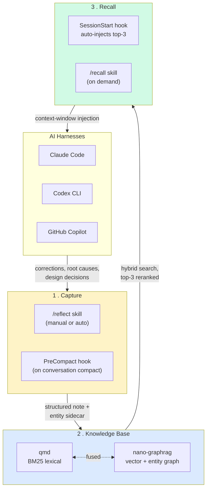

# reflect

> **Correct once, never again.** Capture every correction and design decision your AI assistant makes, index them into a hybrid GraphRAG + BM25 knowledge base, and auto-inject the most relevant prior learnings into every new session.

Works across **Claude Code**, **Codex CLI**, and **GitHub Copilot** — same plugin, same KB, three harnesses.

---

## Why

If you've used AI coding assistants for more than a week, you've corrected the same mistake twice. Maybe ten times. The assistant doesn't remember that:

- Your team uses Bun, not Node, for that one repo
- The Postgres migration in your project must run before the seed
- That third-party library has a footgun you discovered last month
- "When I ask you to delete files, also clean the imports"

`reflect` fixes that by **capturing** corrections as structured learnings, **indexing** them into a searchable knowledge base, and **recalling** the relevant ones at the start of every new session — automatically, before the first token of your prompt is generated.

---

## How it works



**Flow:**

1. **Capture** — `/reflect` analyses your conversation, classifies corrections vs. successes, and writes a Markdown learning note + a YAML entity sidecar (people, files, libraries, decisions). A `PreCompact` hook auto-fires when the agent compacts a conversation, so nothing gets lost.
2. **Knowledge Base** — notes get dual-indexed: nano-graphrag for semantic + entity-graph search, qmd for fast BM25 lexical search. Both run locally on your machine.
3. **Recall** — at every `SessionStart`, a hook runs hybrid search against the KB using the new session's working dir + recent commits as a query, fuses the results, reranks by confidence × recency × tag overlap, and injects the top three into the agent's context before you type anything.

---

## Sub-skills

| Skill | What it does |
|-------|--------------|
| `reflect` | Full conversation scan — extract corrections, classify them, write a learning note with entity sidecar |
| `reflect:recall` | Query the KB on demand (also runs automatically at SessionStart) |
| `reflect:ingest` | Bulk-index existing memories from any tool (Claude/Codex/Copilot/Gemini) into the global KB |
| `reflect:consolidate` | Project-level memory consolidation — merges orphaned worktree memory dirs into a single `.agents/MEMORY.md` |
| `reflect-status` | Read-only metrics: pending reviews, sidecar coverage, GraphRAG health. Approve/reject low-confidence items. |

---

## Install

### Claude Code (recommended)

```bash
claude plugin marketplace add stevengonsalvez/agents-in-a-box
claude plugin install reflect@agents-in-a-box

# install the underlying CLI (provides nano-graphrag + qmd)
uv tool install --force --upgrade 'git+https://github.com/stevengonsalvez/reflect-kb.git[graph]'
```

That's it. The next session you open, the SessionStart hook fires `recall` automatically.

### Codex CLI / GitHub Copilot

These harnesses don't have a native plugin runtime yet. Use the python adapter:

```bash
git clone https://github.com/stevengonsalvez/agents-in-a-box.git
cd agents-in-a-box

# pick your harness
python3 toolkit/packages/plugins/reflect/adapters/codex/codex_adapter.py install
python3 toolkit/packages/plugins/reflect/adapters/copilot/copilot_adapter.py install

# same CLI prerequisite
uv tool install --force --upgrade 'git+https://github.com/stevengonsalvez/reflect-kb.git[graph]'
```

---

## Verify it's working

```bash
# Should list reflect@agents-in-a-box, version 3.1.0
claude plugin list

# Should print pending reflections, KB stats, sidecar coverage
/reflect-status
```

After a few sessions, `~/.reflect/drain.log` will show successful drains and `~/.reflect/pending_reflections.jsonl.processed-*` will accumulate as evidence the hooks are firing.

---

## Configuration

Configuration cascades:

1. **Plugin defaults** — bundled `reflect.toml`
2. **User overrides** — `~/.reflect/reflect.toml`
3. **Project overrides** — `.reflect.toml` at the repo root

Most users don't need to touch any of these. Power users adjust:

- `recall.max_results` (default 3) — how many learnings get injected per session
- `recall.confidence_threshold` (default 0.6) — minimum hybrid score for inclusion
- `ingest.batch_size` — for bulk-importing large memory archives

---

## Architecture deep-dive

For the full architecture (pipeline internals, scoring formula, hook contracts, adapter pattern, multi-harness installation strategy), see **[docs/architecture.md](./docs/architecture.md)** (~12-minute read).

For design decisions and the v4 universal-install spec, see **[docs/design-records/](./docs/design-records/)**.

---

## Companion CLI

The Python CLI that powers this plugin lives in a separate repo:
**[stevengonsalvez/reflect-kb](https://github.com/stevengonsalvez/reflect-kb)** — install via `uv tool install`.

The plugin in this repo is the harness-side glue (skills, hooks, settings.json merge); the CLI is the actual KB engine.

---

## License

MIT. See repo root [LICENSE](../../../../LICENSE).
