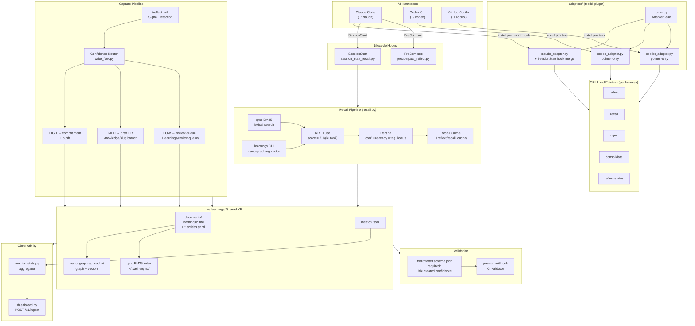
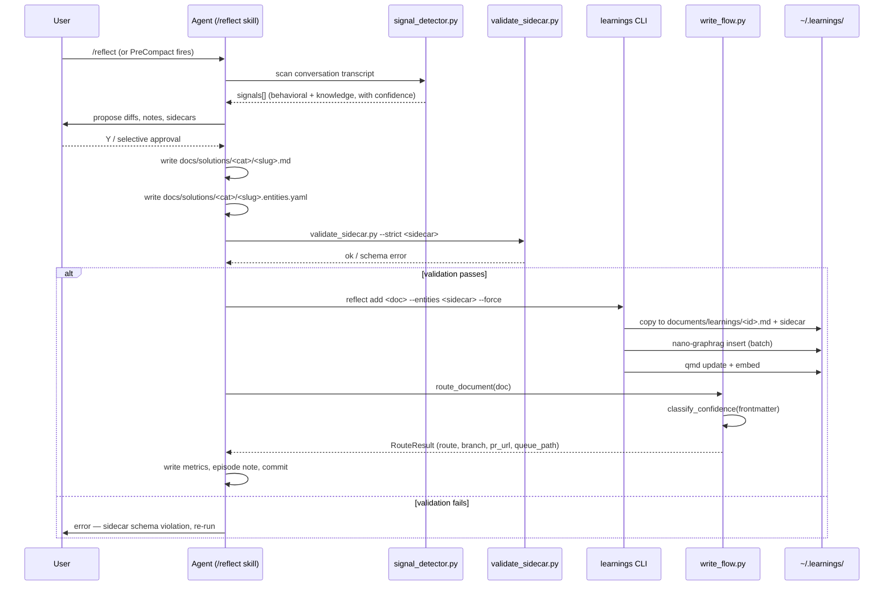
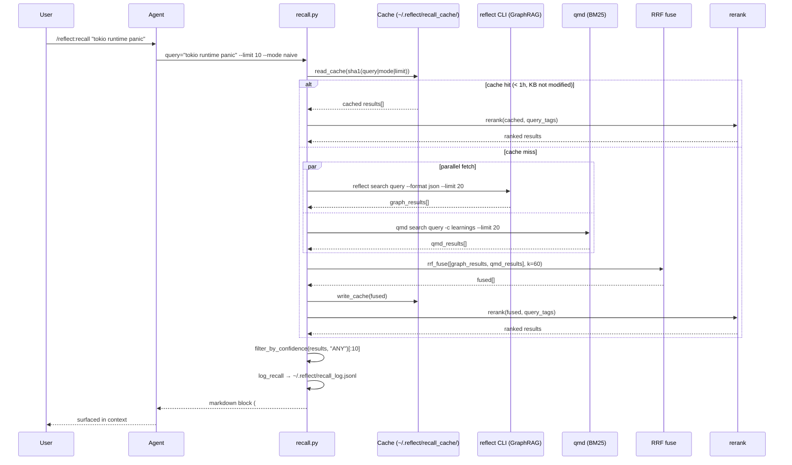
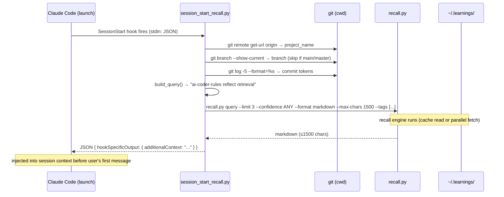
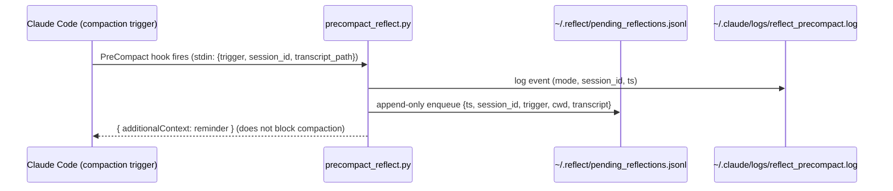

# Reflect + Retrieval System — Architecture Reference

> **Audience**: Engineers joining the project with no prior context on reflect.
> **Date**: 2026-04-25
> **Repos**: `ai-coder-rules` (toolkit) · `reflect-kb` (standalone CLI + KB)

---

## 1. TL;DR

The reflect + retrieval system is a personal knowledge-management layer that sits on top of every AI coding assistant you use — Claude Code, Codex CLI, and GitHub Copilot. Every time you correct the assistant, discover a root cause, or make a design decision, `/reflect` captures it as a structured learning note with an entity graph sidecar. Those notes are indexed into a hybrid search engine (nano-graphrag vector search fused with BM25 lexical search via `qmd`). From that point forward, every new session automatically surfaces the top-three most relevant prior learnings before the first token is generated, so the assistant already knows what you have already figured out. You stop re-explaining the same things and the assistant stops making the same mistakes.

---

## 2. System Diagram



---

## 3. What You Experience

### Opening a Claude session

When you open Claude Code in any project directory, the `SessionStart` hook fires automatically (installed into `~/.claude/settings.json` by the Claude adapter). It runs `session_start_recall.py`, which:

1. Reads `CLAUDE_PROJECT_DIR` (or `cwd`) and calls `git remote get-url origin` to derive a project name.
2. Reads the current branch and the last five commit subjects, extracting tokens (filtering stopwords) to assemble a focused query such as `"ai-coder-rules reflect retrieval-phase".`
3. Calls `recall.py` with a 3-result cap, 10-second timeout, and `--confidence ANY`.
4. Returns the result as a `hookSpecificOutput.additionalContext` JSON object to Claude.

You see something like this at the top of your new session (invisibly injected into context — no UI chrome):

```
## Prior learnings relevant to `ai-coder-rules reflect retrieval`

- **[lrn-nano-graphrag-multi-insert-79d7b2]** Never call graph.insert() sequentially — batching required.
  How to apply: Use insert_documents_batch() for all multi-doc ingest runs.
- **[lrn-graspologic-shim-abc123]** graspologic has broken transitive deps; install shim before nano-graphrag import.
```

The assistant already knows this before your first message.

### Running `/plan` or `/research`

The recall SKILL.md instructs the assistant to run `recall.py` as a preamble when starting any research or planning task. The hybrid search (GraphRAG vector + qmd BM25 fused via RRF) surfaces not just exact keyword matches but conceptually related prior learnings.

### Context is about to compact

When Claude Code's context window approaches its limit, the `PreCompact` hook fires. By default (`--remind` mode) it injects a reminder: _"Context compaction triggered. Consider running `/reflect` before compaction."_ If you have previously run `/reflect on` (enabling `auto_reflect: true` in `~/.reflect/reflect-state.yaml`), the hook instead creates a minimal episode placeholder and runs signal detection automatically.

### Running `/reflect`

You run `/reflect` after a session where something interesting happened. The skill:

1. Scans the conversation for behavioral signals ("never do X", "always Y") and knowledge signals (root causes, fixed bugs, architecture decisions).
2. Classifies them by confidence: HIGH / MEDIUM / LOW.
3. Proposes agent file diffs and knowledge notes with entity sidecars.
4. Shows you a diff and asks for approval (`Y / N / modify / 1,3 / k1,k2`).
5. On approval: writes `docs/solutions/<category>/<slug>.md` and `.entities.yaml`, validates the sidecar, runs `reflect add --entities --force`, and commits.

### Running `/reflect:ingest`

You run `/reflect:ingest` periodically (weekly recommended) to sweep all memory sources across every tool and project into the global KB. It discovers `~/.claude/projects/*/memory/*.md`, `~/.codex/memories/*.md`, `~/.copilot/AGENTS.md`, `~/.gemini/GEMINI.md`, and project-local `docs/solutions/**/*.md` — deduplicates against the ingest log — and presents an approval table before writing. Nothing is indexed without your approval.

### Running `reflect search` and `reflect stats`

```bash
# Semantic search
learnings search "tokio runtime panic" --mode local

# Stats overview
reflect metrics stats
```

Stats output:

```
metric                value
─────────────────────────────
total events          142
recall events         89
recall with hits      71
hit rate              79.8%
p50 latency (ms)      412.0
p95 latency (ms)      1840.0
  tag: rust           14
  tag: async          11
```

---

## 4. Storage Layout

Live filesystem as of the time this document was written:

```
~/.learnings/                          # Shared KB root
├── cli/                               # learnings CLI (installed by bootstrap.js)
│   ├── learnings                      # entry-point executable
│   ├── learnings_cli.py               # click CLI (search, add, reindex, share, stats)
│   ├── graph_engine.py                # nano-graphrag wrapper + batch insert
│   ├── entity_store.py                # sidecar parse + graphrag tuple format
│   ├── graspologic_shim.py            # pure-networkx shim (avoids llvmlite dep)
│   └── requirements.txt
├── documents/
│   ├── learnings/                     # canonical indexed notes
│   │   ├── <slug>-<hash6>.md          # learning note (YAML frontmatter + body)
│   │   └── <slug>-<hash6>.entities.yaml  # entity sidecar (GraphRAG input)
│   ├── memories/                      # archived originals (by project)
│   │   ├── shotclubhouse/
│   │   │   └── MEMORY.md              # <!-- archived: <ISO> --> header prepended
│   │   └── ai-coder-rules/
│   ├── episodes/                      # session episode notes
│   │   └── ep-<slug>-<ts>.md
│   └── clusters/                      # future: cluster/theme summaries
├── nano_graphrag_cache/               # GraphRAG index files
│   ├── graph_chunk_entity_relation.graphml
│   ├── kv_store_community_reports.json
│   ├── kv_store_full_docs.json
│   ├── kv_store_llm_response_cache.json
│   ├── kv_store_text_chunks.json
│   ├── vdb_chunks.json                # vector DB chunks
│   └── vdb_entities.json              # vector DB entities
├── review-queue/                      # LOW-confidence pending approval
│   └── <slug>.yaml                    # pointer record queued for human promotion
├── metrics.jsonl                      # append-only JSONL (rotates at 10 MB)
├── config.toml                        # optional: [dashboard] endpoint + token
├── .memory-ingest-log.yaml            # dedup tracking for reflect:ingest
└── team-config.yaml                   # team KB path (set by `reflect team clone`)

~/.cache/qmd/                          # qmd BM25 index (managed by qmd CLI)
├── index.sqlite
└── (collections: learnings, obsidian, blog, writing)

~/.reflect/                            # reflect state (toolkit side)
├── reflect-state.yaml                 # auto_reflect flag, last_reflection ts
├── reflect-metrics.yaml               # aggregate counts (sessions, signals, etc.)
├── reflect.db                         # SQLite: reflect provider discovery cache
├── recall_cache/                      # per-query JSON cache files (1h TTL)
│   └── <sha1-16>.json
├── recall_log.jsonl                   # every recall event (ts, query, mode, count, cached)
└── pending_reflections.jsonl          # signals queued for later review

~/.claude/skills/                      # Claude Code skill discovery root
├── recall/
│   ├── SKILL.md                       # pointer → toolkit plugin source
│   ├── hooks/
│   │   └── session_start_recall.py    # SessionStart hook
│   └── scripts/
│       └── recall.py                  # recall engine (hybrid search)
├── reflect/
│   ├── SKILL.md                       # pointer → toolkit plugin source
│   ├── hooks/
│   │   ├── precompact_reflect.py      # PreCompact hook
│   │   └── settings-snippet.json      # hook config reference
│   ├── scripts/
│   │   ├── metrics_updater.py
│   │   ├── state_manager.py
│   │   ├── memory_discovery.py
│   │   ├── signal_detector.py
│   │   ├── output_generator.py
│   │   ├── validate_sidecar.py
│   │   └── reflect_config.py
│   ├── references/
│   │   ├── signal_patterns.md
│   │   ├── agent_mappings.md
│   │   ├── classification_rules.md
│   │   └── knowledge_format.md
│   └── assets/
│       ├── learning_template.md
│       ├── episode_template.md
│       └── reflection_template.md
├── ingest/
│   └── SKILL.md
├── consolidate/
│   └── SKILL.md
└── reflect-status/
    └── SKILL.md

~/.codex/skills/                       # Codex pointer skills (pointer-only, no hooks)
├── recall/SKILL.md                    # managed_by: reflect-kb/adapters/codex
├── reflect/SKILL.md
├── ingest/SKILL.md
├── consolidate/SKILL.md
└── reflect-status/SKILL.md

~/.copilot/skills/                     # Copilot pointer skills (pointer-only, no hooks)
├── recall/SKILL.md                    # managed_by: reflect-kb/adapters/copilot
├── reflect/SKILL.md
├── ingest/SKILL.md
├── consolidate/SKILL.md
└── reflect-status/SKILL.md
```

---

## 5. Sequence Diagrams

### 5.1 Capture Flow (`/reflect` → write to KB)



### 5.2 Recall Flow (explicit `/reflect:recall`)



### 5.3 SessionStart Auto-Recall Flow



### 5.4 PreCompact Capture (queue, don't process)



**Why a queue, not synchronous reflection?** Hooks are shell commands —
they cannot invoke an LLM. The agent that captured the conversation is
already exiting (its context is being compacted away). The only honest
move is to **queue and hand off** to a future agent that *does* have an
LLM. That handoff is the auto-drain (5.5).

### 5.5 Closed-Loop Auto-Drain (SessionStart → background `claude -p`)

The drain is what actually closes the capture loop. It fires whenever
**any** new Claude Code session starts on the host, runs in the
background (detached, non-blocking), and walks the queue with headless
`claude -p`. Same script is wired into the Codex and Copilot adapters
once they grow session-init hook parity (see `TODO(closed-loop)` in
`adapters/{codex,copilot}/{tool}_adapter.py`).

```mermaid
sequenceDiagram
    participant CC as New Claude session
    participant H as SessionStart hook (detached)
    participant DRN as reflect-drain-bg.sh
    participant LCK as ~/.reflect/drain.lock
    participant Q as ~/.reflect/pending_reflections.jsonl
    participant CP as claude -p "/reflect $T" --max-turns 25
    participant DOC as ~/.learnings/documents/<slug>.md
    participant SC as <slug>.entities.yaml
    participant IDX as reflect reindex --incremental
    participant GR as nano_graphrag_cache + qmd

    CC->>H: SessionStart fires
    H->>DRN: ( nohup ./drain.sh & ) — detach, return in <100ms
    DRN->>LCK: PID-based lock (skip if held; reclaim if stale)
    DRN->>Q: read up to REFLECT_DRAIN_MAX entries (default 3)
    loop per entry (cap REFLECT_DRAIN_DAILY_MAX/day, default 20)
        alt transcript missing on disk
            DRN-->>Q: archive as "stale", drop from queue
        else transcript present
            DRN->>CP: subscription auth, --permission-mode bypassPermissions
            alt exit 0 (success)
                CP->>DOC: write learning markdown
                CP->>SC: write entity sidecar YAML
                CP-->>DRN: result envelope (cost, turns)
                DRN->>Q: archive entry to .processed-YYYYMMDD
            else exit non-zero AND envelope says "max_turns"
                Note over DRN: partial work; retry++; poison after 3
                DRN-->>Q: keep entry, increment retry-count.jsonl
            else hard error
                DRN-->>Q: log + leave in queue
            end
        end
    end
    DRN->>IDX: reflect reindex --incremental
    IDX->>GR: update graphml + vdb_entities + kv_store_full_docs
    DRN-->>LCK: release on EXIT/INT/TERM trap
```

**Properties**:

- **Non-blocking**: hook returns in milliseconds; drain runs detached
  (`(nohup ... &) >/dev/null 2>&1`).
- **Idempotent**: PID-based lock with stale-lock reclaim — concurrent
  sessions don't multi-drain.
- **Cost-capped**: per-run cap (`REFLECT_DRAIN_MAX`, default 3) and
  per-day cap (`REFLECT_DRAIN_DAILY_MAX`, default 20). At ~$0.20–0.75
  per `/reflect` call (Opus 4.7 + cached system prompt), worst case
  ≈ $15/day.
- **Poison-resistant**: each transcript tracked in
  `~/.reflect/retry-count.jsonl`; entries with `retry > 3` get archived
  with a marker so they don't infinite-loop.
- **Stale-transcript safe**: if the transcript JSONL no longer exists on
  disk (old worktrees, deleted files), drop it cleanly instead of
  failing.
- **Auto-reindex**: after the drain processes its batch, runs
  `reflect reindex --incremental` so new docs land in
  GraphRAG (`graphml` + `vdb_entities`) **and** QMD without manual
  intervention. Recall in the *next* session sees the freshly-captured
  learnings.
- **Cross-tool universal**: the drain script reads the shared
  `~/.reflect/pending_reflections.jsonl`. Any tool's session-init hook
  can fire it. Today only the Claude adapter wires it; Codex and Copilot
  adapters carry `TODO(closed-loop)` markers for parity.

**Configuration surface**:

| Env var | Default | Purpose |
|---|---|---|
| `REFLECT_DRAIN_MAX` | `3` | Max transcripts processed per session-start fire |
| `REFLECT_DRAIN_DAILY_MAX` | `20` | Hard daily cost cap (~$15/day at default rate) |
| `REFLECT_DRAIN_MAX_TURNS` | `25` | Per-`/reflect` LLM turn limit |
| `REFLECT_DRAIN_DRY_RUN` | unset | Set `1` to log intent without spending |

**Files**:

| Path | Purpose |
|---|---|
| `~/.claude/scripts/reflect-drain-bg.sh` | The drain script |
| `~/.reflect/drain.lock` | PID lock (single drain at a time) |
| `~/.reflect/drain.log` | Run log, rotates at 10 MB |
| `~/.reflect/drain-cost.jsonl` | Daily-cap accounting |
| `~/.reflect/retry-count.jsonl` | Per-transcript retry counters |
| `~/.reflect/pending_reflections.jsonl.processed-YYYYMMDD` | Archive of successful drains |

---

## 6. Component Reference

| Module | Repo | Path | Purpose |
|--------|------|------|---------|
| `base.py` | toolkit | `adapters/base.py` | Shared `AdapterBase` — pointer write, sentinel guard, uninstall, argparse CLI skeleton |
| `claude_adapter.py` | toolkit | `adapters/claude/` | Claude harness: extends base with `settings.json` SessionStart hook merge |
| `codex_adapter.py` | toolkit | `adapters/codex/` | Codex harness: pointer-only install (no hook system) |
| `copilot_adapter.py` | toolkit | `adapters/copilot/` | Copilot harness: pointer-only install (no hook system) |
| `session_start_recall.py` | toolkit | `skills/recall/hooks/` | SessionStart hook: builds git-context query, calls recall.py, emits additionalContext JSON |
| `recall.py` (skills) | toolkit | `skills/recall/scripts/` | Hybrid recall engine: GraphRAG + qmd BM25 fan-out, RRF fuse, rerank, 1h cache |
| `precompact_reflect.py` | toolkit | `hooks/` | PreCompact hook: reminder or auto-episode mode depending on reflect-state.yaml |
| `reflect_config.py` | toolkit | `scripts/` | Layered TOML config loader (plugin → user → project → env vars) |
| `memory_discovery.py` | toolkit | `scripts/` | Multi-provider source discovery (Claude/Codex/Copilot/Gemini) |
| `signal_detector.py` | toolkit | `scripts/` | Behavioral + knowledge signal extraction from conversation transcripts |
| `output_generator.py` | toolkit | `scripts/` | Render episode notes and reflection output using templates |
| `state_manager.py` | toolkit | `scripts/` | Read/write `~/.reflect/reflect-state.yaml` (auto_reflect toggle) |
| `metrics_updater.py` | toolkit | `scripts/` | Append to `~/.reflect/reflect-metrics.yaml` (aggregate session counts) |
| `validate_sidecar.py` | toolkit | `scripts/` | JSON Schema validation of `.entities.yaml` sidecars before ingest |
| `reflect.toml` | toolkit | `reflect.toml` | Plugin-bundled config defaults (layer 1 of the config cascade) |
| `learnings_cli.py` | reflect-kb | `src/reflect_kb/cli/` | Click CLI entry-point: `search`, `add`, `reindex`, `share`, `stats`, `team`, `metrics` |
| `graph_engine.py` | reflect-kb | `src/reflect_kb/cli/` | nano-graphrag wrapper: lazy model load, passthrough LLM, `insert_documents_batch()` |
| `entity_store.py` | reflect-kb | `src/reflect_kb/cli/` | Sidecar parse, GraphRAG tuple format, heuristic auto-extraction |
| `graspologic_shim.py` | reflect-kb | `src/reflect_kb/cli/` | Pure-networkx graspologic shim (avoids broken `llvmlite` dep chain) |
| `team.py` | reflect-kb | `src/reflect_kb/cli/` | `reflect team clone/init/push` — provision and sync team KB git repo |
| `write_flow.py` | reflect-kb | `src/reflect_kb/` | Confidence-gated document router: HIGH→commit, MED→draft PR, LOW→review-queue |
| `metrics.py` | reflect-kb | `src/reflect_kb/` | Best-effort JSONL metrics writer (auto-rotate at 10 MB) |
| `metrics_stats.py` | reflect-kb | `src/reflect_kb/` | Linear-scan JSONL aggregator: all-time + 7-day `StatsReport` |
| `metrics_cli.py` | reflect-kb | `src/reflect_kb/cli/` | `reflect metrics stats` + `reflect metrics dashboard sync` CLI |
| `dashboard.py` | reflect-kb | `src/reflect_kb/` | Opt-in POST client: builds envelope, retries once on 5xx/transport error |
| `frontmatter.schema.json` | reflect-kb | `schemas/` | JSON Schema v2020-12 for learning document frontmatter validation |

---

## 7. Configuration Surface

### `~/.learnings/config.toml` — dashboard (opt-in)

```toml
[dashboard]
endpoint = "https://your-dashboard.example.com"
token    = "your-bearer-token"
# client_id is auto-derived from hostname; override here if needed:
# client_id = "my-machine"
```

Without this section, all dashboard commands exit 0 with "dashboard not configured". The section is entirely opt-in — the rest of the system does not require it.

### `~/.claude/settings.json` — hooks (managed by Claude adapter)

The Claude adapter writes and later removes these entries:

```json
{
  "hooks": {
    "SessionStart": [
      {
        "matcher": "",
        "hooks": [
          {
            "type": "command",
            "command": "uv run /Users/<you>/.claude/skills/recall/hooks/session_start_recall.py"
          }
        ]
      }
    ]
  }
}
```

The PreCompact hook is NOT auto-installed. Users copy it from `hooks/settings-snippet.json` manually:

```json
{
  "hooks": {
    "PreCompact": [
      {
        "matcher": "",
        "hooks": [
          {
            "type": "command",
            "command": "uv run /Users/<you>/.claude/skills/reflect/hooks/precompact_reflect.py --remind"
          }
        ]
      }
    ]
  }
}
```

Switch `--remind` to `--auto` after running `/reflect on` to enable automatic episode creation.

### `reflect.toml` — plugin defaults (toolkit-bundled, layer 1)

Located at `toolkit/packages/plugins/reflect/reflect.toml`. This is the base layer of the four-layer config cascade. Users never need to edit this directly.

```toml
[storage]
db_path         = "~/.reflect/reflect.db"
artifacts_dir   = "docs/solutions"

[discovery]
enabled_providers = ["claude", "codex", "copilot", "gemini"]
staleness_days    = 30

[indexers.graphrag]
cli_path    = "reflect"   # reflect-kb; resolved via $PATH
auto_sidecar = true

[policies]
auto_approve_threshold = 0.8
retention_days         = 90
max_memory_lines       = 200
```

**Config cascade** (later wins, all deep-merged):

| Layer | Location | Typical use |
|-------|----------|-------------|
| 1 — plugin defaults | `reflect.toml` (in repo) | Bundled, never user-edited |
| 2 — user override | `~/.reflect/reflect.toml` | Machine-level preferences |
| 3 — project override | `.reflect.toml` (cwd) | Repo-specific overrides |
| 4 — env vars | `REFLECT_DB_PATH`, `REFLECT_PROVIDERS`, `REFLECT_STALENESS_DAYS`, `REFLECT_LOG_LEVEL`, `REFLECT_RETENTION_DAYS`, `REFLECT_AUTO_APPROVE` | CI / per-run injection |

### `schemas/frontmatter.schema.json` — learning document schema

JSON Schema 2020-12. Required fields: `title`, `created`, `confidence`. All others optional but encouraged.

```json
{
  "required": ["title", "created", "confidence"],
  "properties": {
    "title":       { "type": "string" },
    "category":    { "type": "string" },
    "tags":        { "type": "array", "items": { "type": "string" } },
    "symptoms":    { "type": "array", "items": { "type": "string" } },
    "root_cause":  { "type": "string" },
    "key_insight": { "type": "string" },
    "created":     { "type": "string", "format": "date" },
    "confidence":  { "enum": ["high", "medium", "low"] },
    "language":    { "type": "string" },
    "framework":   { "type": "string" }
  }
}
```

### Pre-commit hook (team KB repos)

Team KB repos provisioned via `reflect team init/clone` include a `.pre-commit-config.yaml` that runs `validate_sidecar.py --strict` on every staged `.entities.yaml`. This catches malformed sidecars at commit time before they reach the GraphRAG ingest pipeline.

### Environment variables — quick reference

| Variable | Default | Effect |
|----------|---------|--------|
| `REFLECT_STATE_DIR` | `~/.reflect` | Relocate state dir (recall cache, metrics) |
| `REFLECT_DB_PATH` | `~/.reflect/reflect.db` | SQLite DB path |
| `REFLECT_ARTIFACTS_DIR` | `docs/solutions` | Where `/reflect` writes knowledge notes |
| `REFLECT_PROVIDERS` | `claude,codex,copilot,gemini` | Active providers for ingest discovery |
| `REFLECT_STALENESS_DAYS` | `30` | Age threshold for stale source detection |
| `REFLECT_LOG_LEVEL` | `info` | Telemetry log level |
| `REFLECT_RETENTION_DAYS` | `90` | Knowledge note retention policy |
| `REFLECT_AUTO_APPROVE` | `0.8` | Confidence threshold for auto-approval |
| `REFLECT_CONFIG_PATH` | `~/.learnings/config.toml` | Override dashboard config path |
| `REFLECT_RECALL_DEBUG` | (unset) | Print recall errors to stderr for debugging |

---

## 8. Multi-Harness Mechanics

All three harnesses — Claude Code, Codex CLI, GitHub Copilot — read from the **same** `~/.learnings/` content directory. The harness-specific adapters only manage _pointer_ `SKILL.md` files that redirect each harness's skill discovery to the canonical plugin source. No knowledge is duplicated; only the discovery layer is per-harness.

```
toolkit/packages/plugins/reflect/
└── skills/
    ├── recall/SKILL.md          ← canonical source
    ├── reflect/SKILL.md
    ├── ingest/SKILL.md
    ├── consolidate/SKILL.md
    └── reflect-status/SKILL.md

~/.claude/skills/recall/SKILL.md     → points to canonical, managed_by: reflect-kb/adapters/claude
~/.codex/skills/recall/SKILL.md      → points to canonical, managed_by: reflect-kb/adapters/codex
~/.copilot/skills/recall/SKILL.md    → points to canonical, managed_by: reflect-kb/adapters/copilot
```

### Sentinel-aware collision protection

Every pointer contains a `managed_by:` YAML field unique to its harness (`reflect-kb/adapters/claude`, `/codex`, `/copilot`). Before writing, `_write_pointer()` in `base.py` checks whether an existing file at the destination lacks this sentinel — if so, it refuses to overwrite and returns a "refused to overwrite non-pointer file" message. The user must pass `--force` to replace hand-written siblings. This protects users who happen to have named their own skill `recall` or `reflect`.

### Hook parity

Only Claude Code has a lifecycle hook system capable of running a subprocess on `SessionStart` and `PreCompact`. Codex and Copilot receive pointer-only installs. Their `SKILL.md` templates explicitly state "invocation-only — call `/recall`, `/reflect`, etc. manually." If those harnesses add hook support in the future, the relevant adapter subclass simply overrides `execute_extra` and `uninstall_extra` (as `ClaudeAdapter` does today).

### Upgrading pointer content

When the canonical `SKILL.md` in the toolkit plugin changes, no reinstall is needed — the pointer files just contain the path to the source file; the harness reads it at skill-scan time. Only structural changes (new skills added to `PLUGIN_SKILLS`, hook command path changes) require a reinstall via `python claude_adapter.py install`.

---

## 9. Confidence Routing Detail

Every learning captured via `/reflect` or `learnings share` is classified by the `confidence` field in its YAML frontmatter. The routing decision is made by `write_flow.classify_confidence()`.

| Confidence | Aliases accepted | Route | Git action | PR | Review queue |
|------------|-----------------|-------|------------|----|----|
| `high` / `h` / `HIGH` | `high` | `route_high()` | Commit `feat(knowledge): <title> [HIGH]` to `main`, push to `origin HEAD:main` | No PR — direct to main | No |
| `medium` / `med` / `m` / `MED` / `MEDIUM` | `medium` | `route_medium()` | Create / reset `knowledge/<slug>` branch, commit `docs(knowledge): <title> [MED]`, push with `-u` | `gh pr create --draft` (requires `gh` CLI) | No |
| `low` / `l` / `LOW` | `low` | `route_low()` | No git operation | No | Yes — writes `~/.learnings/review-queue/<slug>.yaml` |
| (missing) | — | defaults to `medium` | Same as MED | Same as MED | No |

**Review queue record format** (`~/.learnings/review-queue/<slug>.yaml`):

```yaml
category: debugging-sessions
confidence: low
created: "2026-04-20"
queued_at: "2026-04-25T10:31:00+00:00"
slug: react-hydration-mismatch-tricky-case
source: /Users/you/project/docs/solutions/debugging-sessions/react-hydration-mismatch-tricky-case.md
tags:
- react
- hydration
- ssr
title: React hydration mismatch tricky case
```

**Graceful fallback**: If `team_root` is `None` (no team KB configured), HIGH and MED routes fall back silently to the review queue with a note: "no team KB configured (run `reflect team clone <url>`); queued for review". No content is dropped.

**To promote from queue**: Users run `learnings share <source_path>` or manually run `reflect team push` once a team KB is configured.

---

## 10. Observability

### JSONL metrics line shape

`~/.learnings/metrics.jsonl` — one JSON object per line, appended by `metrics.py:write_metric()`:

```json
{
  "ts":         "2026-04-25T10:31:00+00:00",
  "op":         "recall",
  "harness":    "claude",
  "query":      "tokio runtime panic",
  "mode":       "naive",
  "hits":       3,
  "latency_ms": 412,
  "tags":       ["rust", "async"]
}
```

Other ops: `"search"`, `"share"`, `"add"`. The harness field is auto-detected from env vars (`CLAUDECODE`, `CODEX_CLI`, `GITHUB_COPILOT`). The file rotates to `metrics-<YYYYMMDDTHHMMSSZ>.jsonl.bak` when it exceeds 10 MB.

### Recall log shape

`~/.reflect/recall_log.jsonl` — logged by `recall.py:log_recall()`:

```json
{
  "ts":     "2026-04-25T10:31:00",
  "query":  "tokio runtime panic",
  "mode":   "naive",
  "count":  3,
  "cached": false
}
```

### Stats CLI output

```bash
reflect metrics stats
# table output (rich):
#
#    last-7d
#  metric                value
#  total events          89
#  recall events         63
#  recall with hits      51
#  hit rate              81.0%
#  p50 latency (ms)      390.0
#  p95 latency (ms)      1720.0
#    tag: rust           14
#    tag: async          11
#
#    all-time
#  ... (same shape, all records)

reflect metrics stats --format json   # machine-parseable
```

### Dashboard POST payload contract

The payload schema is `reflect-kb.dashboard.ingest/v1`. Receiving servers should validate the `schema` field:

```json
{
  "schema":    "reflect-kb.dashboard.ingest/v1",
  "client_id": "my-hostname",
  "run_id":    "550e8400-e29b-41d4-a716-446655440000",
  "stats": {
    "metrics_path": "/Users/you/.learnings/metrics.jsonl",
    "generated_at": "2026-04-25T10:31:00+00:00",
    "all_time": {
      "label":            "all-time",
      "total_events":     142,
      "recall_events":    89,
      "recall_with_hits": 71,
      "hit_rate":         0.798,
      "p50_latency_ms":   412.0,
      "p95_latency_ms":   1840.0,
      "top_tags":         [["rust", 14], ["async", 11]]
    },
    "last_7d": { "label": "last-7d", "..." : "..." }
  }
}
```

The `run_id` is a fresh UUID4 per sync call — servers use it to deduplicate retried requests.

---

## 11. Failure Modes

The system is designed to degrade silently rather than block the user's session.

| Failure | Detection | Graceful degrade |
|---------|-----------|-----------------|
| `reflect` CLI not installed | `find_learnings_cli()` returns `None` (neither `shutil.which("reflect")` nor the legacy `~/.learnings/cli/learnings` resolves) | `recall()` returns `RecallResult([], error="reflect CLI not found on $PATH (install with \`uv tool install reflect-kb\`)")`. Session starts with empty context. If `REFLECT_RECALL_DEBUG` is set, the error prints to stderr. |
| `qmd` not installed | `shutil.which("qmd")` returns `None` | `fetch_qmd()` returns `[]`. RRF proceeds with only the GraphRAG leg. Hybrid recall degrades to vector-only recall. |
| `qmd` times out (> 10s) | `subprocess.TimeoutExpired` | Caught; returns `[]`. Same as not installed. |
| GraphRAG cache stale / corrupted | `graph_engine.search()` raises `GraphEngineError` | `recall.py` returns `RecallResult([], error=...)`. User can run `reflect reindex --force` to rebuild. |
| nano-graphrag sequential-insert bug | Community reports dropped on N+1 `insert()` calls | `insert_documents_batch()` in `graph_engine.py` is the canonical API. `reflect add` uses single-insert (safe for one doc); `reindex` uses batch. This is documented in `MEMORY.md`. Do not call `graph.insert()` sequentially in a loop. |
| `git` not on PATH | `OSError` in `session_start_recall.py:git_capture()` | Returns `""`. Query falls back to cwd basename only. Session starts with degraded query quality but no crash. |
| SessionStart hook takes > 10s | `subprocess.TimeoutExpired` in `session_start_recall.py` | `emit("")` is called — session starts with empty context. The 10s cap is intentional ("SessionStart must feel instant"). The recall cache makes repeat sessions fast; the first cold miss is absorbed silently. |
| `uv` not on PATH | `shutil.which("uv")` returns `None` in hook | `UV_BIN = None` → hook calls `emit("")`. Session starts empty. |
| `settings.json` contains invalid JSON | `json.JSONDecodeError` in `_merge_session_start_hook()` | `RuntimeError` is re-raised and printed to stderr; `execute_extra()` returns exit code 2. The file is never touched. User must fix the JSON manually. |
| Adapter install collides with hand-written `SKILL.md` | `POINTER_MANAGED_BY` sentinel absent in existing file | `_write_pointer()` returns `(False, "refused to overwrite ...")`. Install continues with the other skills; exit code is 1. The user sees the warning and can re-run with `--force`. |
| Dashboard endpoint unreachable | `httpx.TransportError` | `post_stats()` retries once. On second failure, exception propagates to `sync()`, which returns `(1, "dashboard POST failed: ...")`. Exit code 1 is surfaced by the CLI. The metrics JSONL is never deleted — the next sync attempt will include all accumulated events. |
| Dashboard returns 4xx | `response.status_code >= 400` | No retry (4xx = client/config bug). `sync()` returns exit code 1 with HTTP status in the message. |
| Team KB `gh` not installed | `shutil.which("gh")` returns `None` | `route_medium()` skips PR creation, appends "gh not available — branch pushed; open the PR manually" to `RouteResult.notes`. Branch is still committed and pushed. |
| Team KB push fails (no remote, auth issue) | `subprocess.CalledProcessError` | `_safe_push()` appends the stderr to `RouteResult.notes` and returns `pushed=False`. The document remains in the local team-kb clone; user can push manually. |
| Sidecar schema validation fails | `validate_sidecar.py --strict` exits non-zero | `/reflect` skill prints "ERROR: sidecar validation failed" and halts ingest for that document. The `.md` is still written; only the index step is skipped. User fixes the sidecar and re-runs `reflect add`. |

---

## 12. Boundaries — What This Is Not

**Not a vector database service.** There is no daemon, no server, no port. The retrieval pipeline is a subprocess fan-out to the `learnings` CLI and `qmd` binary. Latency is 200ms–2s per query (often cached to ~5ms). It is not appropriate for sub-10ms real-time lookup in production applications.

**Not a team chat layer.** There is no real-time sharing, no notification system, no webhook. The "team KB" feature is a git-based async sharing model: learnings flow into a shared git repo via PRs. Synchronization is pull-based.

**Not a long-term memory replacement.** The KB stores _explicit_ structured learnings — things you consciously reflect on and approve. It does not automatically record every session. The `~/.claude/projects/*/memory/MEMORY.md` files (written by Claude's own memory system) are inputs that `/reflect:ingest` can harvest, but they are distinct from the reflect KB itself.

**Not multi-tenant.** All paths are `~/<user>` rooted. There is no concept of workspace isolation, user namespacing, or per-project KB separation within a single machine. A team KB is a shared _git repo_ that multiple users each clone locally — there is no shared server.

**Not a replacement for project documentation.** Knowledge notes live in `docs/solutions/<category>/` within each project repo. They are versioned alongside the code they describe and are part of the normal PR review flow. The reflect system is a _discovery layer_ on top of these files, not a substitute for writing them.

**Not AI-generated content.** The entity sidecars, confidence classifications, and write routing are the result of explicit human approval at each capture step. The agent _proposes_; the user _approves_. Nothing is committed to the KB or to git without a `Y` from the user.

---

## Appendix A — Recall Scoring Formula

```
score(learning) = confidence_weight × recency × (1 + tag_bonus)

confidence_weight:
  HIGH   = 1.0
  MEDIUM = 0.7
  LOW    = 0.4

recency = exp(−age_days / 90)   # half-life ≈ 62 days

tag_bonus = 0.1 × |query_tags ∩ learning_tags|
```

The RRF fuse score (pre-rerank) is:

```
rrf_score(doc) = Σ over sources: 1 / (60 + rank_in_source)
```

Documents appearing in both the GraphRAG result list and the qmd result list get summed scores, naturally surfacing cross-confirmed hits.

---

## Appendix B — Entity Sidecar Format

```yaml
document_id: lrn-react-hydration-mismatch-79d7b2
extracted_at: "2026-04-25T10:30:00+00:00"
entities:
  - name: "react"
    type: technology
    description: "UI library for building component-based interfaces"
  - name: "hydration mismatch"
    type: error
    description: "Server-rendered HTML does not match client render output"
  - name: "useEffect mounted check"
    type: pattern
    description: "Defer dynamic content to client-only rendering using a mounted flag"
relationships:
  - source: "dynamic content in SSR"
    target: "hydration mismatch"
    type: caused_by
    description: "Server and client render different content for dynamic values"
    strength: 9
  - source: "useEffect mounted check"
    target: "hydration mismatch"
    type: solves
    description: "Prevents mismatch by deferring content to post-hydration render"
    strength: 10
```

Valid `type` values for entities: `technology`, `error`, `pattern`, `function`, `concept`, `tool`, `artifact`, `code`, `config`, `service`, `platform`, `framework`, `library`.

Valid `type` values for relationships: `caused_by`, `solves`, `requires`, `relates_to`, `uses`, `implements`, `configures`, `triggers`, `part_of`.

Strength scale: 9–10 = direct/causal, 5–7 = moderate, 1–4 = weak.

---

## Appendix C — Pre-commit Schema Check (Team KB)

Team KB repos provisioned by `reflect team init` contain a `.pre-commit-config.yaml` that runs `validate_sidecar.py --strict` on staged `.entities.yaml` files. The same validator is run by `/reflect` before calling `reflect add`, so the pre-commit check is a belt-and-suspenders guard for directly-committed files.

```yaml
# .pre-commit-config.yaml (auto-generated by reflect team init)
repos:
  - repo: local
    hooks:
      - id: validate-sidecar
        name: Validate entity sidecar
        entry: python scripts/validate_sidecar.py --strict
        language: python
        files: \.entities\.yaml$
        pass_filenames: true
```
