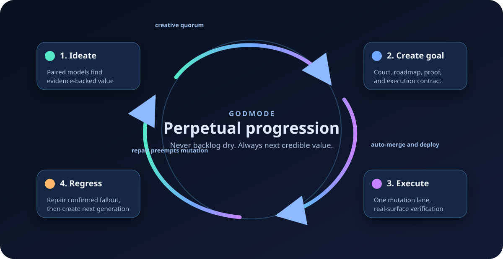

# godmode

An autonomous product factory for Claude Code, Codex, and Copilot CLI. Every
programme explicitly selects `finite` or `perpetual` mode. Perpetual mode pairs
independent models for creative work, continuously creates evidence-backed
goals, runs full regression after each epic, repairs confirmed fallout, then
creates the next progression until hard safety, budget, or deadline limits fire.



**Ideate → create goal → execute → regress and repair → create next goal.**
Planning and regression overlap. Mutation stays single-lane. Every creative
decision carries independent model views, evidence, dissent, and synthesis.

Two things the plugin adds that the bare skill could not:

- **Status that cannot be skipped.** A hook renders and publishes a live
  dashboard on every state change (no model turn), and a Stop-hook gate blocks
  shipping a phase until its explainer is published.
- **Cross-machine run state.** The programme's state, charter, and a
  single-driver lease ride a dedicated git ref (`refs/godmode/<slug>`), so a
  second machine can watch it or take it over after a crash.

Driving depends on declared provider capability. Claude uses its native
scheduler. Codex uses native automation. Copilot requires a configured external
scheduler adapter. Missing capability defers driving visibly, while status and
sidecar inspection remain available.

---

## Install

All three CLIs read the marketplace at the ainb-toolkit repo root and install
godmode from `plugins/godmode/`. Verified end-to-end: skill + hooks land in each
CLI's plugin cache.

**Claude Code**

```bash
claude plugin marketplace add stevengonsalvez/ainb-toolkit
claude plugin install godmode@ainb-toolkit
```

**Codex** (reads the same `.claude-plugin/marketplace.json`; shares the
Claude-format `hooks/hooks.json` by convention)

```bash
codex plugin marketplace add stevengonsalvez/ainb-toolkit
codex plugin add godmode@ainb-toolkit
```

**Copilot CLI** (reads `.github/plugin/marketplace.json`; uses the
Copilot-format `hooks/copilot-hooks.json`)

```bash
copilot plugin marketplace add stevengonsalvez/ainb-toolkit
copilot plugin install godmode@ainb-toolkit
```

Each `marketplace add` also accepts a local path instead of `owner/repo` for
testing an unmerged checkout. Update with your CLI's `plugin update` after a
version bump (godmode ships the same version across all three provider
manifests).

### Prerequisites

- `git`, `jq`, `python3`, and `bd` (beads) on `PATH`.
- **Publishing** (Claude, for the live dashboard + explainers): the sibling
  `here-now` and `explain-to-me` skills and a `~/.herenow/credentials` file
  (mode 0600). If any are missing, `/godmode status` prints
  `status publishing DISABLED: missing <X>` and the run keeps going with a
  staleness banner rather than failing.

---

## Use

`/godmode` (Claude) or the `godmode` skill (Codex/Copilot).

| Command | What it does |
|---|---|
| `/godmode "<north-star>" --mode finite\|perpetual [--approval none\|roadmap] [--budget <tokens>] [--deadline <ISO>]` | INIT: charter + state + dashboard + beads, then finite delivery or perpetual evolution |
| `/godmode run [--take-over]` | Resume/continue the loop from state (any session, incl. post-crash). Claims the driver lease first; `--take-over` forces it after a confirm |
| `/godmode status` | Read state + beads + dashboard + lease, report, change nothing. Safe on any machine/provider |
| `/godmode pause` | Stop re-arming the loop; state stays resumable; releases the lease |

`approval_policy: roadmap` is optional. Perpetual programmes normally use
`none`: they continue through goal generations, while safety and hard caps are
the only global stops.

### What each provider can do

| Capability | Claude | Codex | Copilot |
|---|---|---|---|
| init / run (drive the loop) | native scheduler | native automation required | external scheduler required |
| status / discover | yes | yes | yes |
| dashboard publish · sidecar sync · lease guard | all hooks | hooks.json (shared) | sessionStart pull + staleness nudge |

### Single machine vs. two machines

Single machine is the common case and needs nothing special: the lease
degenerates to always-you and the sidecar becomes a crash-proof backup. Set
`GODMODE_SYNC=local` to skip remote pushes entirely (zero cost, no cross-machine
resume). For two machines, one holds the driver lease and drives; the other runs
`/godmode status` (read-only) or `/godmode run --take-over` to claim a
stale/crashed lease.

---

## How it works

Three things worth seeing: the delivery pipeline, the hook-enforced driver loop,
and the cross-machine sidecar + lease.

### 1. The pipeline (north-star → shipped epics)

```
/godmode "<north-star>"  --budget --deadline --fable
        │
        ▼
   DISCOVER ......... brainstorm the nirvana landscape → feature REGISTRY
        │
        ▼
   FEASIBILITY COURT  every idea → feasible | downgrade | park+blocker
        │
        ▼
   ROADMAP .......... cluster survivors → ordered epics, seed beads
        │
        ▼
   ┌─ [HUMAN GATE] ── the ONE blocking gate: user blesses roadmap ──┐
   │        │  (pre-blessable for autonomous runs)                  │
   └────────┼───────────────────────────────────────────────────────┘
            ▼
   per epic, serial on stacked branches:
   ┌──────────────────────────────────────────────────────────┐
   │ PLAN → adversarial review → verify the revise             │
   │   ▼                                                        │
   │ EXECUTE  build (model pair) → pair review → adversarial    │
   │   ▼      epic review → VERIFY (drive the real UI/TUI/API,  │
   │          not mocks) → bounded fix loop ≤2                  │
   │   ▼                                                        │
   │ SHIP     stacked PR + close beads w/ evidence + dashboard  │
   └──────────────────────────────────────────────────────────┘
            │  backlog replenish (completeness critic) ──┐
            ▼                                             │
   TERMINATION: backlog-dry | budget | deadline ◀────────┘
   first to fire wins → final summary + notification → stop
```

### 2. The driver loop + hook enforcement

The model drives each tick; the harness-run hooks make status and sync
unskippable.

```
        ScheduleWakeup ~600s (re-arms itself, same prompt)
                          │
                          ▼
   ┌─ TICK (model / the DRIVER session) ──────────────────────┐
   │ 1. read charter + state.json (outrank memory)            │
   │ 2. check running workflow; advance state machine         │
   │ 3. lease.sh refresh    (lost → handoff, stop re-arming)   │
   │ 4. update beads + state.json  ← via Write/Edit TOOL only  │
   │ 5. re-arm ScheduleWakeup                                  │
   └───────────────┬──────────────────────────────────────────┘
                   │ writes state.json
                   ▼
   PostToolUse hook (harness-run, cannot be skipped)
   ┌──────────────────────────────────────────────────────────┐
   │ render dashboard ─▶ publish to here.now ─▶ sidecar push   │
   │ (deterministic, NO model turn)                            │
   └──────────────────────────────────────────────────────────┘

   phase flips to *_SHIP / HUMAN_GATE / DONE
                   │
                   ▼
   Stop hook: explainer receipt for this phase?
        no  ─▶ BLOCK the stop: "publish the phase explainer"
        yes ─▶ allow stop
   (scoped to the driver session; subagents + bystanders exempt)
```

| Hook | Fires on | Does |
|---|---|---|
| PostToolUse | state.json write | render + publish dashboard, push sidecar |
| Stop | turn end | gate: block if phase shipped w/o explainer; + heartbeat push |
| SessionStart | startup/resume | pull sidecar |
| PreCompact | compaction | push sidecar (insurance) |

### 3. Cross-machine sidecar + single-driver lease

State rides a dedicated git ref, guarded by a heartbeat lease. Push rejection is
the lock.

```
                     origin
                     └─ refs/godmode/<slug>   (NOT main; one commit/sync)
                         {state.json, charter.md, lease.json}
                         ▲                              │
              push (holder-gated,                       │ pull
               content-CAS, debounced)                  ▼
   ┌─ Machine A (lease holder) ─┐        ┌─ Machine B ──────────────┐
   │ /godmode run · drives loop │        │ /godmode status          │
   │ heartbeat each tick        │        │ read-only mirror         │
   └────────────────────────────┘        └──────────────────────────┘

   lease lifecycle:
   [unclaimed] ──run──▶ [held: machine/user/SESSION]
                            │ heartbeat < TTL (1800s) keeps it fresh
                            ▼
              heartbeat stale (holder crashed)?
                │ yes                    │ no
                ▼                        ▼
        Machine B auto-claims      B run → refused
                                   B run --take-over → confirm → adopt
```

The load-bearing invariant: the lease and the data live on the **same ref**, so
every machine reads and writes the same cell, which is what stops two drivers
(split-brain). `GODMODE_SYNC=local` opts a single-machine run out of remote sync
entirely.

---

## More

- **Deep runbook, troubleshooting, version policy:** [`../../docs/godmode-plugin.md`](../../docs/godmode-plugin.md)
- **The constitution + stage playbooks:** [`skills/godmode/SKILL.md`](skills/godmode/SKILL.md) and `skills/godmode/references/`
- **Tests:** `npm run test:plugin` (bats), `npm run test:plugin:e2e` (sandbox install)

Use godmode for a multi-epic programme driven end-to-end with real verification.
NOT for a single feature or a one-off build; reach for `/make-a-goal` or a plain
`/plan` there.
